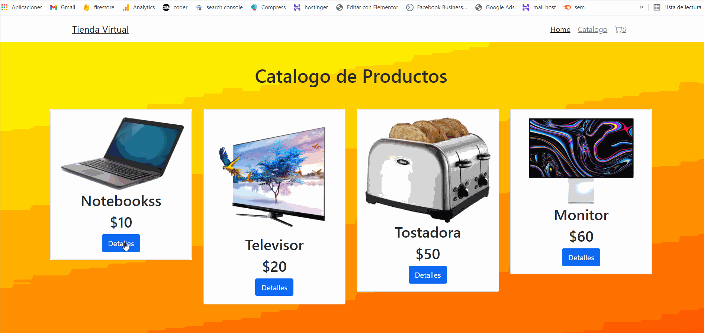

# Proyecto de CoderHOuse Tienda Virtual

## Scripts disponibles

INstalación de dependencias:

### `npm i`

Correr aplicación localmente:
[http://localhost:3000](http://localhost:3000) 

### `npm start`
Para buildear la aplicacion 

### `npm run build`

### Navegacion de la APP

